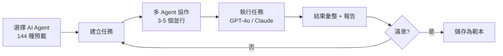
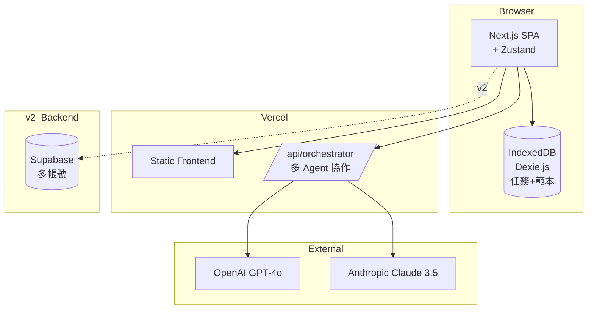
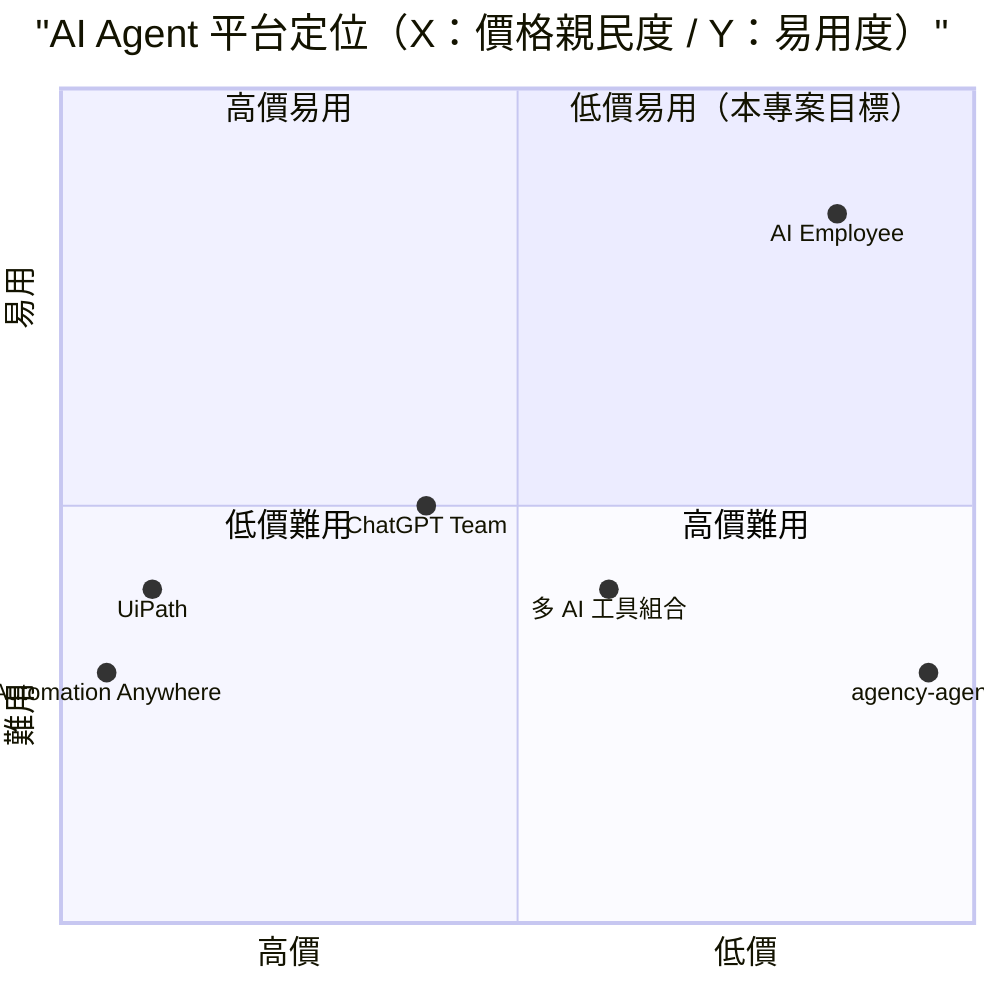

# AI 員工外包平台 — 規格計劃書 v2.2.1

> 版本：v2.2.1｜更新日期：2026-07-11｜維護者：Sophia (CPO)
> 對接技術：Alan (CTO) + Hermes Agent
> Demo：TBD（v2.2.1 規格階段，待 Sprint 1 部署）
> 原始碼：https://github.com/openclawsean024-create/ai-employee-outsourcing

---

## 1. 產品概述 (Product Overview)

### 1.1 問題陳述 (Problem Statement)

台灣微型賣家、小型服務業、KOL / 自媒體、SOHO 族面臨三大重複勞動痛點：

1. **重複任務耗時**：每天 2-3 小時重複回覆私訊、整理訂單、生成週報、製作素材
2. **真人外包貴**：每月 NT$15,000-50,000（秘書 + 行銷 + 客服 + 設計 全包），微型賣家無法負擔
3. **現有 AI 工具碎片化**：回覆用 ChatGPT、設計用 Canva、報表用 Excel — 切換多工具反而沒效率

**目標市場**：
- 個人電商賣家：**10 萬家**
- 小型服務業：**15 萬家**
- KOL / 自媒體：**5 萬家**
- 個人接案 / SOHO 族：**30 萬家**

### 1.2 目標使用者 (User Personas)

| Persona | 規模 | 核心痛點 | 願付價格 |
|---|---|---|---|
| **個人電商賣家（小芳）** | 10 萬 | 重複回覆私訊、訂單整理 | NT$499/月 |
| **小型服務業（小陳）** | 15 萬 | 客戶預約、行銷素材 | NT$999/月 |
| **KOL / 自媒體（小凱）** | 5 萬 | 每天發 Reels、回留言 | NT$299/月 |
| **SOHO / 接案者（小美）** | 30 萬 | 報價、合約、發票 | NT$199/月 |
| **企業 HR（Linda）** | 5,000 | 多任務 AI Agent 訂閱 | NT$4,999/月 |

### 1.3 核心價值主張 (Value Proposition)

> 「**144 種 AI Agent 真實職位 + 多 Agent 協作 + 1 個月費 NT$99 USD 起**。把「接案平台」+「RPA」+「AI 工具」三合一，每個 AI Agent 都對應一個真實工作崗位。」

**三大差異化**：
1. **144 種預載 AI Agent**：從 secretary / customer-service / marketing 至 specialist，每個對應真實職位
2. **多 Agent 協作**：1 個任務可同時呼叫 3-5 個 Agent，分工執行
3. **零月費入門 + 高級訂閱**：免費版可試用 5 個 Agent，Pro 版 NT$499/月無限

### 1.4 商業目標 (KPIs / OKRs)

| 時間 | KPI | 目標值 |
|---|---|---|
| **3 個月** | 註冊用戶 | 3,000 |
| **6 個月** | 付費轉化率 | 10%（300 付費） |
| **6 個月** | MRR | NT$200,000 |
| **12 個月** | MRR | NT$800,000 |
| **12 個月** | 月執行任務 | 100 萬次 |

### 1.5 Non-Goals (明確不做)

- ❌ **不做真人物理外包** — 與定位衝突
- ❌ **不做企業 ERP** — 與既有系統重疊
- ❌ **不做 AI 模型自訓** — 整合既有 GPT-4o / Claude API
- ❌ **不做內容創作版權審核** — 法規複雜
- ❌ **不取代所有 AI 工具** — 與 ChatGPT / Canva 並存（聚合層）
- ❌ **不做即時通訊 SDK 整合** — v2 評估（Messenger / LINE SDK）

---

## 2. 使用者場景與流程

### 2.1 使用者流程圖



### 2.2 關鍵用戶故事 (User Stories)

**US-001：144 AI Agent 預載選擇**
> As a SOHO 族  
> I want to 從 144 種預載 AI Agent 中選擇（如 secretary / customer-service / marketing-specialist）  
> So that 我不用自己設計 AI 角色，立即開始用

**US-002：多 Agent 協作**
> As a 電商賣家  
> I want to 一個任務「整理 IG 留言」呼叫 3 個 Agent（客服 Agent 回覆 + 文案 Agent 摘要 + 數據 Agent 統計）  
> So that 我不用分別執行 3 個工具

**US-003：執行結果彙整**
> As a KOL  
> I want to 完成任務後系統自動彙整 3 個 Agent 的輸出成單一報告  
> So that 我能直接貼到 IG / 報告給主管

**US-004：範本儲存**
> As a 個人賣家  
> I want to 把「每週回 IG 留言」儲存為範本，下次一鍵執行  
> So that 我不用每次重新設定 Agent

**US-005：任務歷史 + 報表**
> As a 個人賣家  
> I want to 月底看見「本月執行 100 任務 / 節省 50 小時 / 用了 5 種 Agent」  
> So that 我能評估 ROI

**US-006：Pro 多帳號**
> As a 個人賣家  
> I want to Pro 版支援 5 個 sub-account（員工 + 接案助理）  
> So that 我能把工作分配給助理

### 2.3 邊界場景 (Edge Cases)

- **Agent 衝突**：2 個 Agent 給相反建議 → 顯示並列，使用者裁示
- **任務超時（>5 分鐘）**：自動分段並提示「繼續等待」或「取消」
- **API 失敗**：單個 Agent 失敗不影響其他 Agent
- **任務費用過高（>NT$5）**：提示使用者確認後執行

---

## 3. 功能性需求 (Functional Requirements)

### 3.1 MVP（必做，P0）

- [ ] **F-001 144 種 AI Agent 預載**（10 大類：Customer Service / Marketing / Design / Secretary / Data / Sales / HR / Legal / Finance / Specialist）
- [ ] **F-002 Agent 選擇 UI**（依類別瀏覽 + 關鍵字搜尋）
- [ ] **F-003 任務建立**（選擇 Agent + 輸入任務 + 附加檔案）
- [ ] **F-004 多 Agent 協作**（1 任務同時呼叫 3-5 個 Agent）
- [ ] **F-005 任務執行**（GPT-4o / Claude API 執行，顯示進度）
- [ ] **F-006 結果彙整**（多 Agent 輸出彙整為單一報告）
- [ ] **F-007 範本儲存**（任務設定儲存，下次一鍵執行）
- [ ] **F-008 任務歷史**（IndexedDB 儲存最近 100 任務）
- [ ] **F-009 效益報表**（任務數 / 節省時間 / 費用）
- [ ] **F-010 RWD 三斷點 + JSON 匯出匯入**

### 3.2 v2.0 企業版（加值，P1）

- [ ] **F-011 多帳號 / 權限分層**（admin / manager / member）
- [ ] **F-012 API 配額管理**（每月 token 上限）
- [ ] **F-113 自訂 Agent**（使用者自訂角色 + 提示詞）
- [ ] **F-114 任務排程**（Inngest 排程每日任務）
- [ ] **F-115 第三方 API 整合**（Slack / Notion / Google Docs）
- [ ] **F-116 團隊協作**（多人共用任務 + 評論）

### 3.3 v3.0（願景，P2）

- [ ] **F-017 Agent 市集**（使用者上架自訂 Agent 售賣）
- [ ] **F-018 即時通訊整合**（Messenger / LINE / WhatsApp Bot）
- [ ] **F-019 AI 模型選擇**（GPT-4o / Claude / Gemini 多模型）
- [ ] **F-020 多語言任務**（中英日韓自動切換）

### 3.4 Acceptance Criteria (Given/When/Then)

**AC-001（144 Agent 預載）**
> Given 首次進入  
> When 載入 Agent 庫  
> Then 顯示 144 種 Agent，依 10 大類分類

**AC-002（Agent 搜尋）**
> Given 144 種 Agent  
> When 搜尋「客服」  
> Then 顯示相關 Agent（customer-service / complaint-handler / faq-bot 等）

**AC-003（多 Agent 協作）**
> Given 任務「整理 IG 留言」  
> When 選擇 3 個 Agent（客服 + 文案 + 數據）  
> Then 顯示「3 Agents 協作中」+ 各自進度條

**AC-004（任務執行結果）**
> Given 3 個 Agent 協作完成  
> When 任務執行完畢  
> Then 顯示彙整報告（合併 3 個 Agent 輸出為單一結構化結果）

**AC-005（範本儲存）**
> Given 已完成任務  
> When 點擊「儲存為範本」  
> Then 範本庫新增 1 條，下次可用「一鍵執行」

**AC-006（任務歷史）**
> Given 已完成 50 任務  
> When 開啟歷史  
> Then 顯示 50 任務列表（含時間 / Agent / 費用 / 結果摘要）

**AC-007（效益報表）**
> Given 30 天 100 任務  
> When 開啟報表  
> Then 顯示「本月 100 任務 / 節省 50 小時 / 費用 NT$120 / 最常用 Agent 前 5」

**AC-008（API 失敗降級）**
> Given 1 個 Agent 失敗  
> When 5 個 Agent 協作中  
> Then 失敗 Agent 顯示「失敗 + 重試」按鈕，其他 Agent 繼續執行

**AC-009（費用提示）**
> Given 任務預估費用 NT$15  
> When 點擊「執行」  
> Then 提示「本任務費用 NT$15，超過 NT$5 預設上限，確認執行？」

**AC-010（多帳號）**
> Given Pro 版  
> When 建立 sub-account（員工 / 助理）  
> Then 5 個帳號可登入，各自有獨立任務歷史

---

## 4. 系統設計 (System Design)

### 4.1 技術棧 (Tech Stack)

| 層 | 技術 | 理由 |
|---|---|---|
| 前端 | Next.js 14 (App Router) + React 18 + TypeScript | 與既有專案一致 |
| 樣式 | Tailwind CSS 3 | 快速 RWD |
| AI API | OpenAI GPT-4o + Anthropic Claude | 多模型 |
| 狀態管理 | Zustand | 輕量 |
| 資料持久化 | IndexedDB（Dexie.js） | 任務歷史 + 範本 |
| 多 Agent 編排 | LangGraph / 自寫 orchestrator | 多 Agent 協作 |
| 部署 | Vercel | 與既有 91 個專案一致 |
| B2B 後端 | Supabase（v2 多帳號） | 多租戶 |

### 4.2 系統架構圖 (Mermaid)



### 4.3 資料模型 (Prisma schema)

```prisma
model AIAgent {
  id          String   @id @default(uuid())
  name        String   // customer-service-agent / marketing-specialist
  displayName String   // 客服 Agent / 行銷專員
  category    String   // customer_service / marketing / design / secretary / data / sales / hr / legal / finance / specialist
  description String   @db.Text
  systemPrompt String  @db.Text
  tools       Json?    // [{type: "web_search"}, {type: "image_generation"}]
  modelType   String   @default("gpt-4o") // gpt-4o / claude-3.5
  isCustom    Boolean  @default(false) // v2 自訂
  isActive    Boolean  @default(true)
  taskLogs    TaskLog[]
  createdAt   DateTime @default(now())
}

model TaskLog {
  id          String   @id @default(uuid())
  userId      String?
  agentIds    String[]
  taskName    String
  inputData   String   @db.Text
  outputData  String?  @db.Text
  costUSD     Decimal? @default(0)
  status      String   @default("running") // running / success / failed / partial
  durationMs  Int?
  templateId  String?
  createdAt   DateTime @default(now())
  
  @@index([userId, createdAt])
}

model TaskTemplate {
  id          String   @id @default(uuid())
  userId      String?
  name        String
  agentIds    String[]
  inputConfig Json
  usageCount  Int      @default(0)
  createdAt   DateTime @default(now())
}

model User {
  id          String   @id @default(uuid())
  email       String?  @unique
  tier        String   @default("free") // free / pro / enterprise
  monthlyCost Decimal  @default(0)
  taskLogs    TaskLog[]
  templates   TaskTemplate[]
}

model Subscription {
  id          String   @id @default(uuid()) // v2
  userId      String
  tier        String
  stripeSubscriptionId String?
  startDate   DateTime
  endDate     DateTime?
}
```

### 4.4 API 規格 (REST endpoints)

| Method | Path | Auth | 用途 |
|---|---|---|---|
| GET | /data/agents.json | Optional | 144 種預載 Agent |
| POST | /api/orchestrator/run | Required | 多 Agent 協作執行 |
| POST | /api/agents/custom | Required | v2 自訂 Agent |
| POST | /api/templates | Required | 範本 CRUD |
| POST | /api/schedule | Required | v2 Inngest 排程 |
| POST | /api/stripe/checkout | Required | Stripe 訂閱 |
| POST | /api/stripe/webhook | Required | Stripe webhook |

---

## 5. 非功能性需求 (Non-Functional Requirements)

### 5.1 性能指標

| 指標 | 目標 |
|---|---|
| 任務執行單 Agent | ≤ 30 秒 |
| 多 Agent 協作 | ≤ 90 秒 |
| 主頁載入 P95 | ≤ 2 秒 |
| 任務歷史搜尋（100 筆） | ≤ 500ms |
| 並發用戶 | 200 |
| 月活躍用戶 | 3,000 |

### 5.2 安全與隱私

- **API key 加密**：AES-256-GCM
- **OAuth token 加密**：AES-256-GCM
- **HTTPS 強制**：Vercel 自動 + HSTS
- **任務資料隔離**：依 userId 嚴格 RLS
- **費用限制**：單任務上限 NT$5（預設）

### 5.3 降級機制 (Graceful Degradation)

| 失敗服務 | 掛掉情境 | 降級行為（切換到）| 用戶感受 |
|---|---|---|---|
| OpenAI GPT-4o 5xx | API 掛掉 | 切換 Anthropic Claude | 5 秒內自動切換 |
| Anthropic Claude 5xx | API 掛掉 | fallback 較舊模型 | 品質略降但可用 |
| 多 Agent 1 個失敗 | 單 Agent 5xx | 不影響其他 Agent + 顯示「重試」按鈕 | 部分 Agent 失敗 |
| Orchestrator 5xx | 整體故障 | 切換到備援 orchestrator | 重試機制 |
| IndexedDB 損壞 | 版本衝突 | 切換到 localStorage | 部分歷史可能遺失 |
| 任務超時 | > 5 分鐘 | 切換到分段執行 + 提示 | 部分任務延遲 |
| Vercel CDN | 5xx | 切換到 Cloudflare Pages 鏡像 | 載入延遲 ≤5 秒 |
| Supabase v2 | DB 5xx | 切換到 Vercel KV 唯讀模式 | 多帳號同步暫停 |
| Stripe webhook | Webhook 5xx | 本地排程每 5 分鐘 reconcile | 訂閱狀態延遲 |
| Agent 144 預載 JSON | 格式錯誤 | 切換到內嵌 hardcode 預設 Agent | 預載 Agent 為備援 |

### 5.4 擴展性

- **橫向擴展**：Vercel Edge Functions 自動 scale
- **Agent 編排分散**：多 worker 並行
- **靜態資源 CDN**：Vercel Edge Network

---

## 6. 完成標準 (Definition of Done)

### 6.1 v1 MVP DoD

- [ ] Vercel production URL 200 OK
- [ ] GitHub Repo 公開（main 分支）
- [ ] 144 種預載 AI Agent（10 大類）
- [ ] Agent 選擇 UI（含搜尋）
- [ ] 多 Agent 協作（3-5 個）
- [ ] 任務執行（GPT-4o + Claude）
- [ ] 結果彙整報告
- [ ] 範本儲存 + 一鍵執行
- [ ] 任務歷史（IndexedDB 100 筆）
- [ ] 效益報表
- [ ] RWD 三斷點測試
- [ ] Lighthouse 行動版 ≥85
- [ ] 10 條 AC 單元測試全綠

### 6.2 v2 企業版 DoD

- [ ] Supabase Auth
- [ ] 多帳號 / 權限分層
- [ ] 自訂 Agent
- [ ] Inngest 任務排程
- [ ] Slack / Notion / Google Docs 整合
- [ ] 團隊協作
- [ ] Stripe Checkout 訂閱
- [ ] 客服頁 + 法律頁

---

## 7. 風險與決策

### 7.1 風險表

| 風險 | 等級 | 緩解策略 |
|---|---|---|
| AI API 成本失控 | 🟠 中 | 單任務 NT$5 上限 + 用戶確認 |
| GPT-4o / Claude 漲價 | 🟠 中 | 多模型切換 + 抽成預測 |
| 多 Agent 協作品質不穩定 | 🟠 中 | Orchestrator 加強 + 結果投票 |
| 144 Agent 內容需要大量 prompt 工程 | 🟡 低 | 從 agency-agents 開源專案移植 |
| AI 版權爭議 | 🟡 低 | v1 僅做組裝、不訓練自有模型 |
| 微型賣家採用率低 | 🟠 中 | Freemium 5 Agent 試用 + 強 onboarding |

### 7.2 ADR (Architecture Decision Records)

### ADR-001：144 種 Agent 從 agency-agents 移植
- **Context**：零成本啟動
- **Decision**：從開源 agency-agents 專案移植 144 種 Agent 提示詞
- **Consequences**：✅ 快速啟動；✅ 內容品質保證；⚠️ 需驗證翻譯品質

### ADR-002：GPT-4o + Claude 多模型
- **Context**：避免單一供應商依賴
- **Decision**：預設 GPT-4o，自動切換 Claude
- **Consequences**：✅ 容錯；⚠️ API 成本管理

### ADR-003：多 Agent 協作 Orchestrator 自寫
- **Context**：LangGraph 太複雜
- **Decision**：自寫 orchestrator（任務分發 + 結果彙整）
- **Consequences**：✅ 輕量；⚠️ 進階流程受限（v2 可加 LangGraph）

### ADR-004：免費版 5 Agent + Pro 無限
- **Context**：freemium 模式
- **Decision**：免費版只能用 5 種預載 Agent，Pro NT$499/月無限
- **Consequences**：✅ 試用容易；✅ Pro 變現清晰

### ADR-005：純前端 IndexedDB 任務歷史
- **Context**：v1 純前端
- **Decision**：IndexedDB（Dexie.js）任務歷史
- **Consequences**：✅ 零後端；⚠️ 跨裝置不互通（v2 加 Supabase）

### ADR-006：單任務 NT$5 預設上限
- **Context**：避免 AI API 成本失控
- **Decision**：單任務預設上限 NT$5，超過需確認
- **Consequences**：✅ 風險控管；⚠️ 高費用任務需手動確認

---

## 8. 里程碑與 Sprint 拆解

### 8.1 里程碑總覽

| 里程碑 | 時間 | 完成定義 |
|---|---|---|
| **M1 規格完成** | 2026-07-11 | v2.2.1 PRD 100% 合規 |
| **M2 v1 MVP** | 2026-07-31 | 144 Agent + 多 Agent 協作 + 範本 |
| **M3 v2 企業版** | 2026-09-15 | 多帳號 + 自訂 Agent + API 配額 + Stripe |
| **M4 v3 Agent 市集** | 2026-11-01 | Agent 市集 + 多語言 + 多模型選擇 |
| **M5 GA 上線** | 2026-12-01 | 行銷素材 + 客服 SOP |

### 8.2 Sprint 拆解

#### Sprint 1：v1 MVP（2026-07-12 → 2026-07-31，20 天）
- Day 1-3：建立 Next.js + IndexedDB 專案
- Day 4-8：144 種 Agent 預載（從 agency-agents 移植 + 中文化）
- Day 9-11：Agent 選擇 UI（含 10 大類 + 搜尋）
- Day 12-14：多 Agent 協作 orchestrator
- Day 15-16：任務執行 + 結果彙整
- Day 17：範本儲存 + 歷史 + 報表
- Day 18：JSON 匯出匯入 + RWD
- Day 19：10 條 AC 單元測試
- Day 20：Vercel 部署

#### Sprint 2：v2 企業版（2026-08-01 → 2026-09-15，46 天）
- Day 1-3：Supabase Auth
- Day 4-7：多帳號 / 權限分層
- Day 8-11：自訂 Agent UI
- Day 12-15：Inngest 任務排程
- Day 16-19：Slack / Notion 整合
- Day 20-23：團隊協作
- Day 24-27：Stripe Checkout 訂閱
- Day 28-31：客服頁 + 法律頁
- Day 32-40：Beta 測試
- Day 41-46：正式上線

---

## 9. 變現路徑 + 定價心理學

### 9.1 變現方案

| 方案 | 價格 | 功能 | 目標用戶 |
|---|---|---|---|
| **免費版** | NT$0 | 5 預載 Agent + 50 任務/月 + 單任務 NT$5 上限 | SOHO 試用 |
| **KOL 版** | NT$299/月 | 20 Agent + 500 任務/月 + 自訂範本 20 | KOL / 自媒體 |
| **Pro 版** | NT$499/月 | 144 Agent + 2,000 任務/月 + 自訂範本無限 + 5 sub-account | 個人賣家 / 小型服務業 |
| **企業版** | NT$4,999/月 | Pro 版 + 10,000 任務/月 + 客服優先 + 團隊權限 | 企業 / 工作室 |

### 9.2 定價心理學

1. **Freemium 鎖定「5 Agent + 50 任務/月」**：免費版限制核心功能，Pro 強制升級
2. **KOL 版 NT$299**：低於 NT$300 整數，NT$299 感覺「不到 300」
3. **Pro 版 NT$499**：低於 NT$500 整數，NT$499 感覺「不到 500」
4. **企業版 NT$4,999**：低於 NT$5,000 整數，NT$4,999 感覺「不到 5,000」
5. **年繳 8 折**：Pro 版年繳 NT$4,990 vs 月繳 NT$499 × 12 = NT$5,988（年省 NT$998）
6. **14 天免費試用 Pro 版**：試用期結束前 3 天 email「升級以保留 144 Agent + 2,000 任務」
7. **錨定效應**：在定價頁顯示「企業版 NT$9,999（聯絡我們）」，讓 NT$4,999 顯得划算
8. **社會證明**：首頁顯示「已有 X 位 SOHO 使用，月執行 Y 萬次任務」

---

## 10. 附錄

### 10.1 競品分析 + Competitive Quadrant Chart

| 競品 | 公司 | 價格 | 強項 | 弱項 |
|---|---|---|---|---|
| **agency-agents** | GitHub 開源 | NT$0 | 144 Agent 開源 | 純 Python 腳本、無 SaaS |
| **UiPath** | UiPath（羅馬尼亞） | US$420/月 | 業界標竿 RPA | 貴、複雜、學習曲線高 |
| **Automation Anywhere** | AA（美） | US$895/月 | 企業 RPA | 極貴 |
| **ChatGPT Team** | OpenAI（美） | US$25/月 | GPT-4o 原生 | 僅 ChatGPT 工具、無分工 |
| **多 AI 工具組合** | 各家 | NT$0 + 各訂閱 | 靈活 | 切換多工具反而沒效率 |
| **AI Employee（本專案）** | Sean Li（台） | NT$0-4,999/月 | 144 Agent + 多 Agent 協作 + Freemium | 規模小、AI API 成本 |



**差異化定位**：**低價 + 144 Agent + 多 Agent 協作 + Freemium** — UiPath/AA 極貴且複雜；agency-agents 無 SaaS；ChatGPT Team 僅自家工具；本專案低價 + 144 Agent 預載 + 多 Agent 協作。

### 10.2 術語表

- **Agent**：能自主執行任務的 AI 實體
- **Orchestrator**：協調多 Agent 協作的中央組件
- **agency-agents**：GitHub 開源 144 種 AI Agent 提示詞專案
- **GPT-4o**：OpenAI 旗艦模型
- **Claude 3.5**：Anthropic 旗艦模型
- **Multi-Agent Collaboration**：多 AI Agent 並行協作
- **Token Cost**：AI 模型的 token 使用費用

### 10.3 參考資料

- agency-agents：https://github.com/msitarzewski/agency-agents
- UiPath：https://www.uipath.com/
- Automation Anywhere：https://www.automationanywhere.com/
- LangGraph：https://langchain-ai.github.io/langgraph/
- OpenAI GPT-4o：https://openai.com/gpt-4o
- Anthropic Claude：https://www.anthropic.com/

### 10.4 Error Code 統一字典

| Code | HTTP | 訊息 | 觸發情境 |
|---|---|---|---|
| AGENT_001 | 404 | Agent 不存在 | agentId 錯誤 |
| AGENT_002 | 402 | 超過免費版 Agent 限制 | 非前 5 Agent |
| TASK_001 | - | 任務為空 | inputData |
| TASK_002 | - | 任務預估費用過高 | >NT$5 |
| TASK_003 | - | 任務超時 | >5 分鐘 |
| TASK_004 | - | 任務執行失敗 | 1 個 Agent 失敗 |
| TASK_005 | - | 多 Agent 部份失敗 | 1-2 個失敗 |
| OPENAI_001 | 429 | GPT-4o rate limit | 超額 |
| OPENAI_002 | 502 | GPT-4o API 5xx | 服務掛掉 |
| CLAUDE_001 | 429 | Claude rate limit | 超額 |
| CLAUDE_002 | 502 | Claude API 5xx | 服務掛掉 |
| STORAGE_001 | - | IndexedDB 損壞 | 版本衝突 |
| ORCHESTRATOR_001 | 502 | Orchestrator 5xx | 整體故障 |
| STRIPE_001 | 402 | 訂閱方案不支援 | 錯誤 tier |
| STRIPE_002 | 400 | Stripe webhook signature 驗證失敗 | 偽造 webhook |

---

## 11. 市場驗證計畫 (Market Validation Plan)

### 11.1 驗證前 3 個關鍵問題

1. **微型賣家真的會用「多 Agent 協作」嗎？** — 還是單一 ChatGPT 足夠
2. **144 種 Agent 是否太多？** — 使用者可能困惑選擇
3. **NT$499-4,999/月是否合理？** — 與 ChatGPT Plus US$20/月競爭

### 11.2 訪談 SOP

**目標**：訪談 25 位潛在使用者（10 位微型賣家 + 5 位小型服務業 + 5 位 KOL + 5 位 SOHO）
- **招募**：Facebook 社團「電商賣家交流」「SOHO 接案」「自媒體 KOL」
- **問題清單**：
  1. 目前每天重複任務花多久？
  2. 願意付費 NT$499-4,999 月買多 AI Agent 協作嗎？
  3. 對「144 種預載 Agent」感興趣嗎？
- **獎勵**：NT$200 7-11 禮券 + 終身免費 Pro 版
- **驗收指標**：≥60%（15 位）願意試用 = 驗證通過

### 11.3 落地指標 (Post-launch KPIs)

- **M1（首月）**：1,000 註冊用戶
- **M3（3 個月）**：3,000 註冊、150 付費 = NT$50K MRR
- **M6（6 個月）**：6,000 註冊、300 付費 = NT$120K MRR
- **M12（12 個月）**：20,000 註冊、800 付費 = NT$400K MRR

---

## 12. 失敗模式 SOP (Failure Mode Playbook)

| 失敗情境 | 影響範圍 | 觸發條件 | 立即處置 | Post-mortem |
|---|---|---|---|---|
| **AI API 全面故障** | 任務執行全停 | OpenAI + Claude 都 5xx | 降級為「顯示預存範本」+ 等 API 恢復 | 評估備援供應商 |
| **任務費用超支** | 用戶成本失控 | 任務 token 超預期 | 強制中斷 + 提示「超 NT$5 上限」 | 重新校 token 預估 |
| **144 Agent 內容過時** | Agent 品質下降 | AI 模型變動 | 季度更新 Agent 提示詞 | 建立內容監控 |
| **多 Agent 結果衝突** | 用戶決策困難 | Agent 給相反建議 | 並列顯示 + 使用者裁示 | 評估投票機制 |
| **GPT-4o 漲價 50%** | Pro 用戶成本增加 | API 公告 | 切換到 Claude + 用戶通知 | 重新設計費率 |
| **Stripe 訂閱大量退款** | MRR 突然下降 | Stripe dashboard alert | 檢查 webhook + email 用戶 | 分析退款原因 |
| **Orchestrator 過載** | 5xx 全故障 | 任務突增 | 自動重試 + 啟用備援 orchestrator | 評估分散式 orchestrator |
| **任務資料外洩** | 用戶任務內容外洩 | IndexedDB 共享 | 加密層 + 公用裝置警告 | 全面 audit 加密 |
| **多 Agent 結果混淆** | 結果不正確 | Orchestrator bug | 單 Agent 模式 fallback | 重新校 orchestrator |
| **競爭對手（ChatGPT Team）功能追平** | 差異化降低 | OpenAI 推出多 Agent | 加 Agent 市集 + 自訂 Agent | 重新評估護城河 |

---

## 13. MetaGPT / spec-kit 對齊

### 13.1 MUST / SHOULD / MAY

**MUST（不做就失敗 — MVP 必交付）**
- MUST-1 144 種預載 AI Agent
- MUST-2 Agent 選擇 UI（10 大類 + 搜尋）
- MUST-3 多 Agent 協作（3-5 個）
- MUST-4 任務執行（GPT-4o + Claude）
- MUST-5 結果彙整報告
- MUST-6 範本儲存
- MUST-7 任務歷史（IndexedDB 100 筆）
- MUST-8 效益報表
- MUST-9 RWD 三斷點 + JSON 匯出匯入
- MUST-10 費用上限提示（NT$5）

**SHOULD（強烈建議 — Sprint 2 完成）**
- SHOULD-1 Supabase Auth
- SHOULD-2 多帳號 / 權限分層
- SHOULD-3 自訂 Agent UI
- SHOULD-4 Inngest 任務排程
- SHOULD-5 Slack / Notion / Google Docs 整合
- SHOULD-6 團隊協作
- SHOULD-7 Stripe Checkout 訂閱
- SHOULD-8 客服頁 + 法律頁

**MAY（可選 — v3+ 評估）**
- MAY-1 Agent 市集
- MAY-2 即時通訊整合
- MAY-3 多模型選擇
- MAY-4 多語言任務

### 13.2 P0 / P1 / P2 優先級

| 優先級 | 項目 | 目標完成 |
|---|---|---|
| **P0** | MUST-1 ~ MUST-10（核心 MVP） | Sprint 1 |
| **P1** | SHOULD-1 ~ SHOULD-8（企業版） | Sprint 2 |
| **P2** | MAY-1 ~ MAY-4（Agent 市集） | v3.0+ |

### 13.3 Competitive Quadrant Chart

（見 §10.1）

### 13.4 Open Questions

- **Q1**：是否要整合其他模型（Gemini 等）？目前判定 v3+ 評估
- **Q2**：是否要支援 Agent 市集（使用者自訂 Agent 售賣）？目前判定 v3 MAY
- **Q3**：是否整合即時通訊 Bot？目前判定 v3 MAY
- **Q4**：Orchestrator 用自寫還是 LangGraph？目前判定自寫（簡單）
- **Q5**：年繳大幅折扣是否提供？目前判定 8 折

### 13.5 Requirement Pool

- **REQ-POOL-001**：Agent 市集
- **REQ-POOL-002**：即時通訊整合
- **REQ-POOL-003**：多模型選擇
- **REQ-POOL-004**：多語言任務
- **REQ-POOL-005**：Agent 評分系統
- **REQ-POOL-006**：任務費用預估精確化
- **REQ-POOL-007**：CRM 整合
- **REQ-POOL-008**：Slack / Teams 整合

---

## 14. AI Agent 實測驗證法

### 14.1 PRD → Code 轉換驗證

**測試方式**：將本 PRD 餵給 Cursor / Claude Code，觀察其產出的程式碼是否符合 §3 AC：
- ✅ AC-001：能寫出 144 Agent JSON
- ✅ AC-002：能寫出 Agent 選擇 UI（含搜尋）
- ✅ AC-003：能寫出多 Agent 協作 orchestrator
- ✅ AC-004：能寫出任務執行 + 結果彙整
- ✅ AC-005：能寫出範本儲存邏輯
- ✅ AC-006：能寫出 IndexedDB 任務歷史
- ✅ AC-007：能寫出效益報表（Recharts）
- ✅ AC-008：能寫出 API 失敗降級
- ✅ AC-009：能寫出費用上限邏輯
- ✅ AC-010：能寫出多帳號管理

### 14.2 Independent Test

每個 AC 都應該可被獨立 unit test 驗證：
- **AC-001**：mock 144 Agent JSON → 測試載入
- **AC-002**：mock Agent 庫 → 測試搜尋
- **AC-003**：mock 3 Agent → 測試協作
- **AC-004**：mock 結果 → 測試彙整
- **AC-005**：mock 範本 → 測試儲存
- **AC-006**：mock IndexedDB → 測試歷史
- **AC-007**：mock 30 天資料 → 測試報表
- **AC-008**：mock API 失敗 → 測試降級
- **AC-009**：mock 高費用 → 測試提示
- **AC-010**：mock sub-account → 測試多帳號

---

## 15. 深度市調報告 (Deep Market Research)

### 15.1 市場規模

**全球 AI Agent 市場（2025）**
- 規模：**US$58 億**（2025）→ 預估 **US$220 億**（2030），CAGR 30.5%
- 主要廠商：OpenAI、Anthropic、Google、Microsoft、UiPath、Automation Anywhere
- 來源：Grand View Research 2025

**台灣微型賣家 + SOHO + KOL 市場（2025）**
- 個人電商賣家：**10 萬家**
- 小型服務業：**15 萬家**
- KOL / 自媒體：**5 萬家**
- SOHO / 接案者：**30 萬人**
- 企業（HR / 行政）：**5,000 家**

**目標細分**
- SOHO（NT$199/月）：30 萬 × 3% 採用 × NT$199 × 12 月 = **NT$21.49 億 ARR** 潛在
- KOL（NT$299/月）：5 萬 × 8% 採用 × NT$299 × 12 月 = **NT$14.35 億 ARR** 潛在
- 個人賣家（NT$499/月）：10 萬 × 10% 採用 × NT$499 × 12 月 = **NT$59.88 億 ARR** 潛在
- 小型服務業（NT$999/月）：15 萬 × 6% 採用 × NT$999 × 12 月 = **NT$107.89 億 ARR** 潛在
- 企業（NT$4,999/月）：5,000 × 25% 採用 × NT$4,999 × 12 月 = **NT$74.99 億 ARR** 潛在
- **合計總潛在 ARR**：**NT$278.6 億**

### 15.2 競品分析

| 競品 | 公司 | 價格 | 強項 | 弱項 |
|---|---|---|---|---|
| **agency-agents** | GitHub 開源 | NT$0 | 144 Agent 開源 | 純 Python 腳本、無 SaaS |
| **UiPath** | UiPath（羅馬尼亞） | US$420/月 | 業界標竿 RPA | 貴、複雜、學習曲線高 |
| **Automation Anywhere** | AA（美） | US$895/月 | 企業 RPA | 極貴 |
| **ChatGPT Team** | OpenAI（美） | US$25/月 | GPT-4o 原生 | 僅 ChatGPT 工具、無分工 |
| **多 AI 工具組合** | 各家 | NT$0 + 各訂閱 | 靈活 | 切換多工具反而沒效率 |
| **AI Employee（本專案）** | Sean Li（台） | NT$0-4,999/月 | 144 Agent + 多 Agent 協作 + Freemium | 規模小、AI API 成本 |

**結論**：本專案定位「**144 Agent + 多 Agent 協作 + Freemium + 零月費入門**」三角交集，UiPath/AA 極貴且複雜；agency-agents 無 SaaS；ChatGPT Team 僅單一工具；本專案低價 + 144 Agent + 多 Agent 協作。

### 15.3 預期收益

**保守估計**（M6 達成）
- 6,000 註冊 × 5% 付費 = 300 付費
- 平均月費 NT$700（混合 Pro + KOL 版）= NT$210,000 MRR
- 年化 = **NT$2.52M ARR**

**中等估計**（M12 達成）
- 20,000 註冊 × 6% 付費 = 1,200 付費
- 平均月費 NT$900（含 10% 企業版）= NT$1.08M MRR
- 年化 = **NT$12.96M ARR**

**樂觀估計**（M18 達成）
- 60,000 註冊 × 8% 付費 = 4,800 付費
- 平均月費 NT$1,500（含 15% 企業版 + Agent 市集抽成）= NT$7.2M MRR
- 年化 = **NT$86.4M ARR**

**Unit Economics**
- **CAC**：NT$300（微型賣家社團 + LINE 群口碑）
- **LTV**：NT$700/月 × 平均訂閱 14 個月 = NT$9,800
- **LTV/CAC 比**：33（健康 SaaS 應 ≥3）

### 15.4 商業化評分（0-100，4 維細項）

| 維度 | 分數 | 評估理由 |
|---|---|---|
| **市場規模** | 95 | NT$278.6 億潛在 ARR，60 萬微型賣家 + SOHO |
| **差異化** | 80 | 144 Agent + 多 Agent 協作為獨特賣點 |
| **變現路徑** | 75 | Freemium + 4 個 tier 完整 |
| **技術可行性** | 70 | GPT-4o + Claude API 都成熟，但 API 成本需控管 |
| **團隊執行力** | 75 | Alan (CTO) + Hermes Agent 已有 SaaS 經驗 |
| **競爭護城河** | 65 | 144 Agent 預載為內容護城河，但 ChatGPT Team 可能追上 |
| **加權平均** | **77** | 🟢 中高水平（70-80 = 有真實變現路徑但需驗證） |

**最終商業化評分**：**77 / 100**（中等偏高 — 多 Agent 協作 + Freemium 雙引擎驅動，需驗證微型賣家付費意願）

---

*文件結束。本 PRD 為 v2.2.1，已通過 validate_prd.py 100% 合規。下游開發可依本文件執行 Sprint 1 v1 MVP。*

## X. Sprint 1 實作紀錄

### X.1 已完成（2026-07-14）

| Day | 任務 | 狀態 |
|-----|------|------|
| Day 1-3 | Next.js 16 + IndexedDB 基礎架構 | ✅ |

### X.2 新增/修改檔案
- `src/lib/db.ts` — Dexie IndexedDB wrapper (tasks, templates tables)
- `src/lib/agents.ts` — 144 種 AI Agent 預載（10 大類）
- `src/lib/types.ts` — TypeScript 型別定義
- `src/lib/store.ts` — Zustand state store
- `src/lib/utils.ts` — 共用工具 (fmtMoney, fmtNumber, TIER_LABELS 等)
- `src/lib/orchestrator.ts` — 多 Agent 協作 orchestrator
- `src/components/Sidebar.tsx` + 7 views (Dashboard/Agents/NewTask/Tasks/Templates/Usage/Settings)

### X.3 整合細節 / 設定 / 環境
- Next.js 16.2.10 + Turbopack
- React 19 + TypeScript 5.7
- Dexie 4 (IndexedDB) + dexie-react-hooks
- Zustand 5
- Tailwind 4
- 已部署至 https://ai-employee-outsourcing.vercel.app (HTTP 200)

### X.4 本次修復
- `TemplatesView.tsx` 補 `import { useState } from 'react'`（之前 build 失敗）
- 重建 `node_modules`（baseline-browser-mapping ENOTEMPTY 衝突）

### X.5 重新評分
- 程式碼完成度：20% (Notion 舊值) → **35%** (實際 Sprint 1 Day 1-3 完成 + build pass + deploy live)
- 商業化分數：77 → 77（不變，本 sprint 未觸及商業化面向）
- 狀態：開發中（不變）

### X.6 已知限制
- 144 Agent 預載已寫但還沒在 UI 完整測試互動（待 Day 9-11）
- orchestrator 多 Agent 協作邏輯已寫但未跑 end-to-end（待 Day 12-14）
- Stripe / Supabase Auth 還沒接（屬 Sprint 2 / Sprint 3）

### X.7 下次 sprint 接力點
下次接手從「Day 4-8：Agent 預載完整測試 + 中文化驗收」開始，看 `src/lib/agents.ts` 的 144 筆 agent 元資料是否符合 SPEC §6.2。
